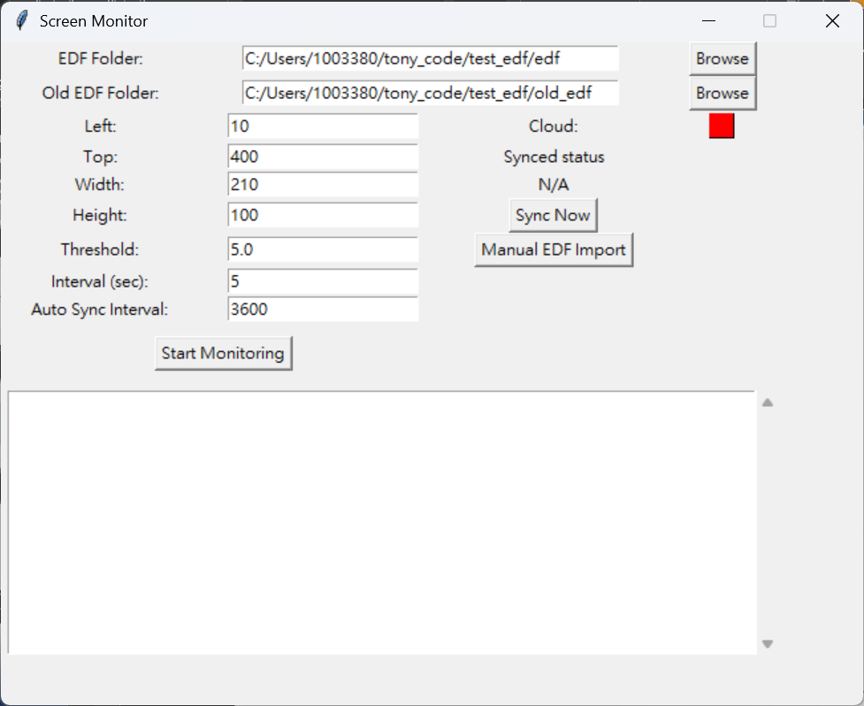

# Screen Monitor & EDF Sync Tool (C# Port)

A robust **screen monitoring and data synchronization tool** designed for industrial machine status tracking. Originally built in Python, this application was ported to **C# (.NET Framework 4.7.2)** to ensure maximum compatibility and stability on legacy **Windows 7** systems.



---

## 🔄 Why C#? (Migration from Python)

This project was initially developed using **Python (Tkinter + MSS)**. However, deploying modern Python environments on older industrial computers running **Windows 7** presented significant challenges:
- **Missing DLLs/Package Dependencies:** Modern libraries often require OS updates not available on legacy machines.
- **Performance & Stability:** The C# WinForms implementation provides a native, single-file executable experience with lower overhead on older hardware.
- **Legacy Support:** .NET Framework 4.7.2 is highly stable on Windows 7, ensuring the app runs reliably without complex environment setup.

---

## 🚀 Key Features

### 1. 🖥️ Screen Monitoring
- **Custom Capture Region:** Define exact screen coordinates (Left, Top, Width, Height) to monitor specific status indicators on machine HMI software.
- **Threshold Detection:** Uses pixel-difference analysis to detect visual changes (e.g., status light changing color).
- **Live Overlay:** A green bounding box highlights the monitored area in real-time.

### 2. 📊 Data Logging & Syncing
- **Triple-Layer Logging:**
  1.  **Local Text:** Human-readable logs in `log.txt`.
  2.  **Local Database:** SQLite (`local_log.db`) buffers data even when offline.
  3.  **Cloud Database:** Automatically syncs status (ON/OFF) to a central **SQL Server**.
- **Offline Resilience:** If the network is down, data is saved locally and synced automatically when the connection is restored.

### 3. 📈 Automated EDF File Processing
- **Smart Trigger:** Automatically detects when the machine turns **OFF**.
- **Data Parsing:** Scans for `.edf` data files generated by the machine.
- **Cloud Upload:** Parses the EDF binary format and uploads detailed voltage/amperage data directly to the SQL Server (`CHEMICAL_TANK_STATUS` table).
- **Archiving:** Automatically moves processed files to an `old_edf` folder to prevent duplicates.

---

## 🛠️ Usage

1.  **Launch:** Run `win7v3.exe` (from the `Release` folder).
2.  **Configure Region:** Use the numeric inputs to position the green overlay over the machine's status indicator.
3.  **Set Threshold:** Adjust sensitivity to ignore minor noise but capture state changes.
4.  **Identifiers:** Set the **Tank ID** (e.g., "A", "B") to tag data correctly in the database.
5.  **EDF Folders:** Select the source folder where the machine saves `.edf` files and the destination for archived files.
6.  **Start:** Click **"Start Monitoring"**.
    - The app will log "ON/OFF" status based on visual changes.
    - When the machine turns **OFF**, it triggers the EDF file processor after a 1-minute delay.

---

## 📂 Project Structure

```text
/production_code
│
├─ README.md               # User Documentation
├─ logging_release.py      # (Legacy) Original Python prototype
│
├─ Logging_release_exe/    # (Legacy) Python Executable Build
│   ├─ logging_release.exe # Standalone Python app (packaged)
│   ├─ config.json
│   └─ local_log.db
│
└─ win7_production/        # C# Source & Build (.NET 6.0)
    ├─ win7v3.cs           # Main Logic (WinForms)
    ├─ win7v3.csproj       # Project File
    ├─ bin/Release/net6.0-windows/logging_1126/
    │   └─ win7v3.exe      # Compiled C# Executable
    ├─ config.json         # Configuration
    ├─ local_log.db
    └─ ...
```

## ⚙️ Configuration (config.json)

The app automatically saves your settings on exit.
- **Threshold:** Sensitivity for detecting screen changes (Lower = more sensitive).
- **Interval:** How often (in seconds) to check the screen status.
- **Auto Sync:** Interval for background cloud synchronization.

---

## 💻 Tech Stack

- **Language:** C#
- **Framework:** .NET 6.0 (Windows Desktop)
- **Database:** 
  - Local: SQLite (`System.Data.SQLite`)
  - Cloud: Microsoft SQL Server (`System.Data.SqlClient`)
- **Image Processing:** `System.Drawing` (Bitmap Locking & Unsafe Byte Manipulation for speed)


---

## Development Guide: Porting from Python to C#

For future developers wishing to port this Python project to a C# Windows application and package it as an EXE, please refer to the following suggestions and existing resources:

### 1. Existing C# Reference Implementation
This repository already contains a C# prototype project located at:
- `production_code/win7_production/`
- This project is developed using **.NET 6.0 (Windows Forms)** and implements basic screen monitoring, database connection, and logging functions. It is recommended to use this as a foundation for further development.

### 2. Technical Recommendations
If re-implementing or maintaining the C# version, the following technology stack is recommended to achieve performance and functionality similar to the Python version:

- **GUI Framework**: Windows Forms (WinForms) is the simplest and most suitable for this type of tool; use WPF if a more modern interface is required.
- **Screen Capture**:
  - The Python version uses `mss`. In C#, `System.Drawing.Graphics.CopyFromScreen` can be used.
  - For higher FPS, using Windows APIs (such as `BitBlt` or `DirectX`) is recommended.
- **Threshold Monitoring**:
  - **Important**: Must use `Bitmap.LockBits` with pointer operations (unsafe code) or `Marshal.Copy` for pixel traversal.
  - **Do NOT** use `GetPixel()`, as its performance is extremely poor and unsuitable for real-time monitoring.
- **Database**:
  - SQL Server: Use `System.Data.SqlClient`.
  - SQLite: Use `System.Data.SQLite` or `Microsoft.Data.Sqlite`.

### 3. Packaging as a Standalone Executable (EXE)
When using .NET 5 / .NET 6+, you can publish the application as a single-file executable using CLI commands, eliminating the need for users to install the .NET Runtime:

```bash
# Execute in the project directory (example for win-x64)
dotnet publish -c Release -r win-x64 --self-contained true -p:PublishSingleFile=true -p:IncludeNativeLibrariesForSelfExtract=true
```
The generated `.exe` file can be run directly on the target machine without environment setup.


## 📝 License

MIT License
